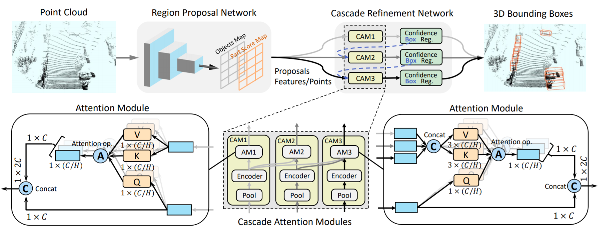

# CasA: CasA: A Cascade Attention Network for 3D Object Detection from LiDAR point clouds 

`CasA` is a simple multi-stage 3D object detection framework based on a Cascade Attention design.
`CasA` can be integrated into many SoTA 3D detectors and greatly improve their detection performance. 
The paper of "CasA: 3D Object Detection with Cascade Attention" is on the way. 


## Overview
- [Cascade Attention Design](#cascade-attention-design)
- [Model Zoo](#model-zoo)
- [Installation](docs/INSTALL.md)
- [Getting Started](docs/GETTING_STARTED.md)
- [Citation](#citation)


## Cascade Attention Design
Cascade frameworks have been widely studied in
2D object detection but less investigated in 3D
space. Conventional cascade structures use multiple separate sub-networks to sequentially refine
region proposals. Such methods, however, have
limited ability to measure proposal quality in all
stages, and hard to achieve a desirable detection
performance improvement in 3D space. We
propose a new cascade framework, termed CasA,
for 3D object detection from point clouds. CasA
consists of a Region Proposal Network (RPN) and
a Cascade Refinement Network (CRN). In this
CRN, we designed a new Cascade Attention Module that uses multiple sub-networks and attention
modules to aggregate the object features from different stages and progressively refine region proposals.
CasA can be integrated into various two-stage 3D detectors and greatly improve their detection performance. 
Extensive experimental results
on KITTI and Waymo datasets with various baseline detectors demonstrate the universality and superiority 
of our CasA. In particular, based on one
variant of Voxel-RCNN, we achieve state-of-the-art
results on KITTI 3D object detection benchmark.




## Model Zoo

### KITTI 3D Object Detection Results
The results are the 3D detection performance of moderate difficulty on the *val* set of KITTI dataset.
Currently, this repo supports CasA-PV, CasA-V, CasA-T and CasA-PV2. The base detectors are 
PV-RCNN, Voxel-RCNN, CT3D and PV-RCNN++, respectively.
* All models are trained with 2 3090 GPUs and are available for download. 
* These models are not suitable to directly report results on KITTI *test* set, please use slightly lower score threshold and 
train the models on all or 80% training data to achieve a desirable performance on KITTI *test* set.

#### PV-RCNN VS. CasA-PV
|               Detectors               | Car(R11/R40) | Pedestrian(R11/R40) | Cyclist(R11/R40)  | download |
|:---------------------------------------------:|:-------:|:-------:|:-------:|:---------:|
| [PV-RCNN baseline](https://github.com/open-mmlab/OpenPCDet) | 83.90/84.83 | 57.90/56.67 | 70.47/71.95 |   | 
| [CasA-PV](tools/cfgs/kitti_models/CasA-PV.yaml) | **86.18/85.86** | **58.90/59.17** | 66.01/69.09 | [model-44M](https://drive.google.com/file/d/1QolF8lkGwlJDpN3MV7-Y5MdhBCROJnfC/view?usp=sharing) | 

#### Voxel-RCNN VS. CasA-V
|               Detectors               | Car(R11/R40) | Pedestrian(R11/R40) | Cyclist(R11/R40)  | download |
|:---------------------------------------------:|:-------:|:-------:|:-------:|:---------:|
| [Voxel-RCNN baseline](https://github.com/open-mmlab/OpenPCDet) | 84.52/85.29 | 61.72/60.97 | 71.48/72.54 |   | 
| [CasA-V](tools/cfgs/kitti_models/CasA-V.yaml)   | **86.54/86.30** | **67.93/66.54** | **74.27/73.08** | [model-44M](https://drive.google.com/file/d/13LO8BAz0h1MbXg97i8k18pHfWGxXEjFP/view?usp=sharing) |

#### CT3D VS. CasA-T
|               Detectors               | Car(R11/R40) | Pedestrian(R11/R40) | Cyclist(R11/R40)  | download |
|:---------------------------------------------:|:-------:|:-------:|:-------:|:---------:|
| [CT3D3cat baseline](https://github.com/hlsheng1/CT3D) | 84.97/85.04 | 56.28/55.58 | 71.71/71.88 |   | 
| [CasA-T](tools/cfgs/kitti_models/CasA-T.yaml)   | **86.76/86.44** | **60.91/62.53** | **73.36**/71.83 | [model-22M](https://drive.google.com/file/d/1pZ4xIa7aTPwAgxUDcbE7b_edctLVXQbb/view?usp=sharing) | 

#### PV-RCNN++ VS. CasA-PV2
|               Detectors               | Car(R11/R40) | Pedestrian(R11/R40) | Cyclist(R11/R40)  | download |
|:---------------------------------------------:|:-------:|:-------:|:-------:|:---------:|
| *[PV-RCNN++ baseline](https://github.com/open-mmlab/OpenPCDet) | 85.36/85.50 | 57.43/57.15 | 71.30/71.85 |   | 
| [CasA-PV2](tools/cfgs/kitti_models/CasA-PV2.yaml)   | **86.32/86.10** | **59.50/60.54** | **72.74/73.16** | [model-47M](https://drive.google.com/file/d/1POWX2ruds3t0XOSvBz5-VmG67c4F9mfE/view?usp=sharing) | 

Where * denodes reproduced results of a simplified version using their open-source codes. 

### Waymo Open Dataset Results
Here we provided two models on WOD, where CasA-V-center denotes that the center-based RPN are used.
All models are trained with **a single frame**  on 8 V100 GPUs, and the results of each cell here are mAP/mAPH calculated by the official Waymo evaluation metrics on the **whole** validation set (version 1.2).    

|    100\% Data, 2 returns        | Vec_L1 | Vec_L2 | Ped_L1 | Ped_L2 | Cyc_L1 | Cyc_L2 |  
|:---------------------------------------------:|----------:|:-------:|:-------:|:-------:|:-------:|:-------:|
| *[Voxel-RCNN baseline](https://github.com/open-mmlab/OpenPCDet)|77.43/76.71| 68.73/68.24 | 76.37/68.21 | 67.92/60.40 | 68.74/67.56 | 66.46/65.35 |
| [CasA-V](tools/cfgs/waymo_models/CasA-V.yaml)|78.54/78.00| 69.91/69.42 | 80.88/73.10 | 71.87/64.78 | 69.66/68.38 | 67.07/66.83 |
| [CasA-V-Center](tools/cfgs/waymo_models/CasA-V-Center.yaml) |**78.62/78.04** | **69.94/69.47** | **81.76/75.69** | **72.75/67.21** | **72.47/71.18** | **70.20/68.94**|

Where * denodes reproduced results using their open-source codes.

We could not provide the above pretrained models due to [Waymo Dataset License Agreement](https://waymo.com/open/terms/), 
but you could easily achieve similar performance by training with the default configs.

## Installation

Please refer to [INSTALL.md](docs/INSTALL.md) for the installation.

## Getting Started

Please refer to [GETTING_STARTED.md](docs/GETTING_STARTED.md) to learn more usage about this project.

## Acknowledgement
This repo is developed from `OpenPCDet 0.3`, we thank shaoshuai shi for his implementation of [OpenPCDet](https://github.com/open-mmlab/OpenPCDet) and the discussion during our CasA design.   

## Citation 
If you find this project useful in your research, please consider cite:

The paper of CasA is on the way. 

```
@article{casa2022,
    title={CasA: 3D Object Detection with Cascade Attention},
    author={Wu, Hai and Deng, Jinhao and Wen, Chenglu and Li, Xin and Wang, Cheng},
    year={2022}
}

@misc{openpcdet2020,
    title={OpenPCDet: An Open-source Toolbox for 3D Object Detection from Point Clouds},
    author={OpenPCDet Development Team},
    howpublished = {\url{https://github.com/open-mmlab/OpenPCDet}},
    year={2020}
}
```
